# GSS Walkii

## Walkii App 分析 - Quantmult X 抓包

務必使用支持 MitM （Man-in-the-Middle，中間人攻擊） 根證書功能的分析工具，然後在 iOS 中信任該證書如下圖，VPN 與裝置管理終須要允許設定檔


接著打開 Quantmult X 配置如下圖，進入設定打開 MitM 重寫配置看是否需要測試直接重試

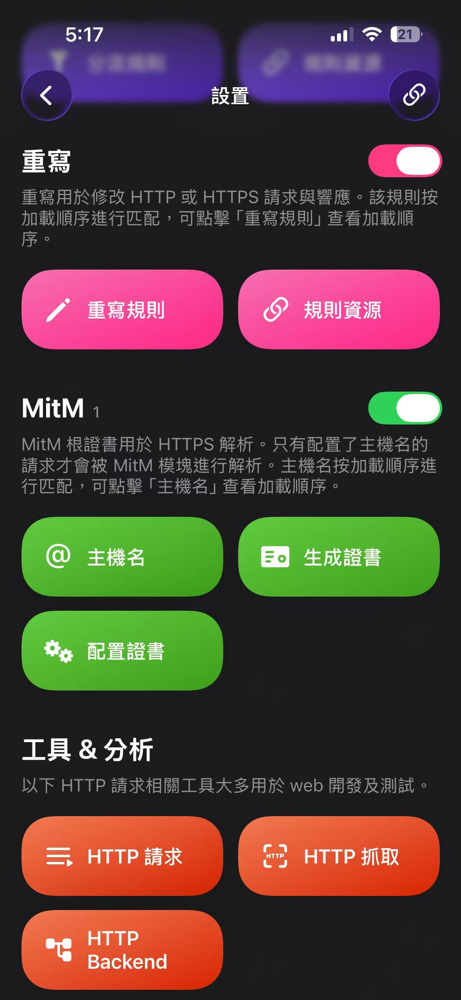

接著回到主畫面打開應用，右上角會出現 VPN 說明已經接管手機上網流量

 

回到設置選擇 HTTP 抓取後進入頁面如下選擇開啟 HTTP 數據抓取，接著就打開 walkii 進行操作即可

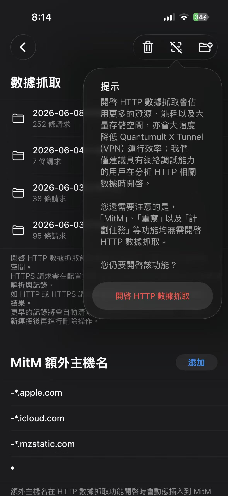

操作完成先關閉 HTTP 數據抓取，接著再重新進入數據抓取就可以看到結果如下

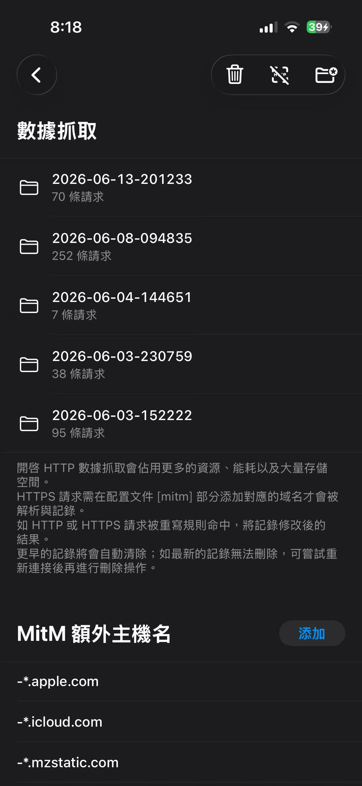

接著就找到對應 API 選擇分享 HAR 即可，如下圖

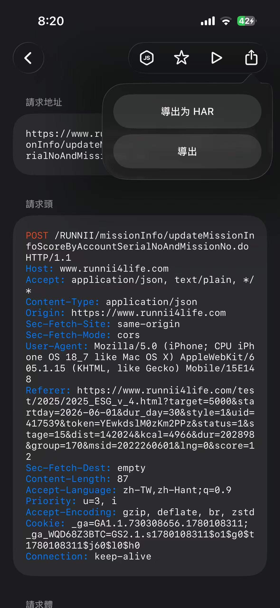

## Walkii Api 測試 - Postman / Requable

### Postman

由於 Postman 不支持直接導入 HAR 檔案格式，因此我們需要先瀏覽器解析 HAR 再轉成 curl 導入 Postman 進行測試，具體操作如下

將 HAR 拖曳到 Chrome 中的 Network 如下圖

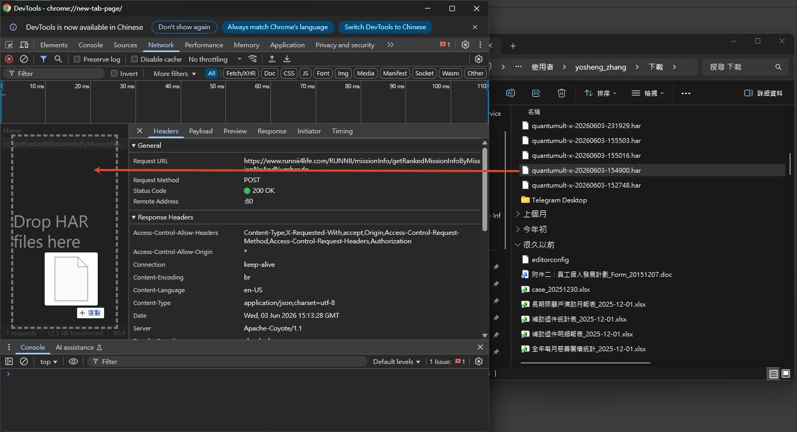

這時候就能直接右鍵複製 curl 如下圖

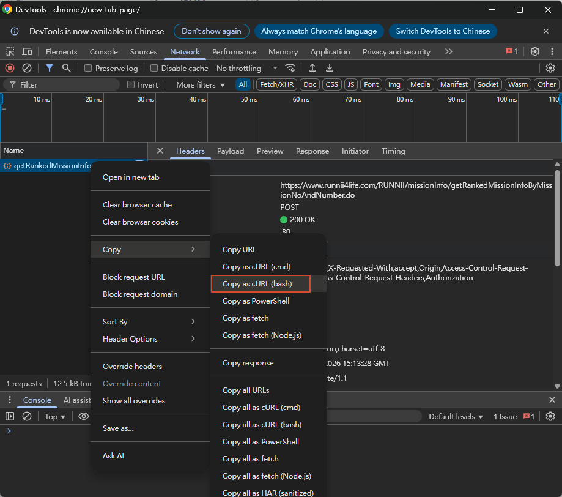

打開 Postman 如下圖操作導入到 Collection 中

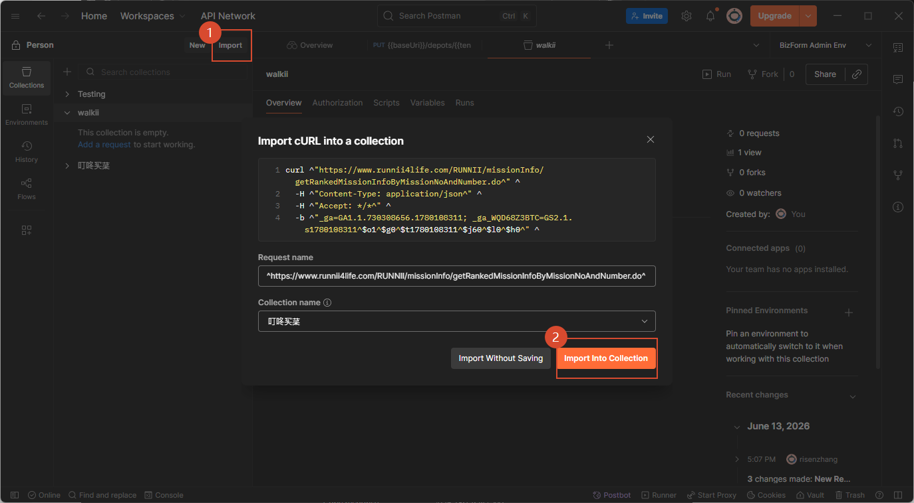

這裡就能進行 API 測試，得到返回結果後我們就可以準備寫前端了

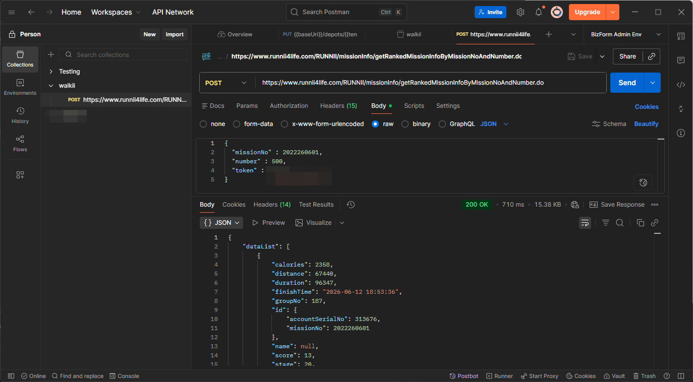

### Requable

如下圖打開APP後直接把 HAR 拖曳到導入即可

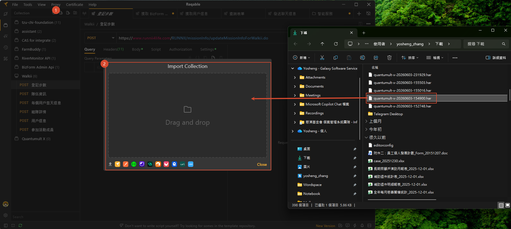

- hoppscotch 導入會顯示錯誤，可能是 Quantmult X 導出的 Json 不是標準 HAR ，但通過 Curl 方式都是相通的

- bruno 不支持直接導入 HAR 

## WebUI 製作 - Vercel & Shadcn

為了方便節約 AI 生成的 Token 消耗，選擇完善且成熟的框架會事半功倍，這裡我選擇 Shadcn ，原因如下

1. 開源且允許商用 MIT 條款

2. 官方提供 CLI 命令可以快速構建應用

3. 相對成熟的 SKILL 和 MCP 可便於AI直接接入

可以通過下面命令直接構建

```shell
pnpm dlx shadcn@latest init
```

可以參考我的配置

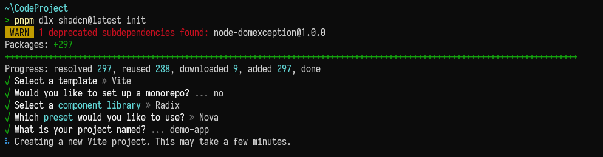

接著為了讓 AI 了解有哪些已有的 UI 組件能夠使用，這裡我們先配置 Skill 如下命令

```shell

pnpm dlx skills add shadcn/ui
```

如下圖

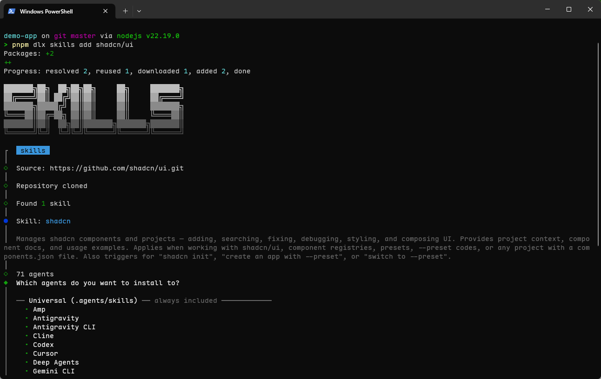

我選擇使用 CaudeCode 安裝完成如下圖

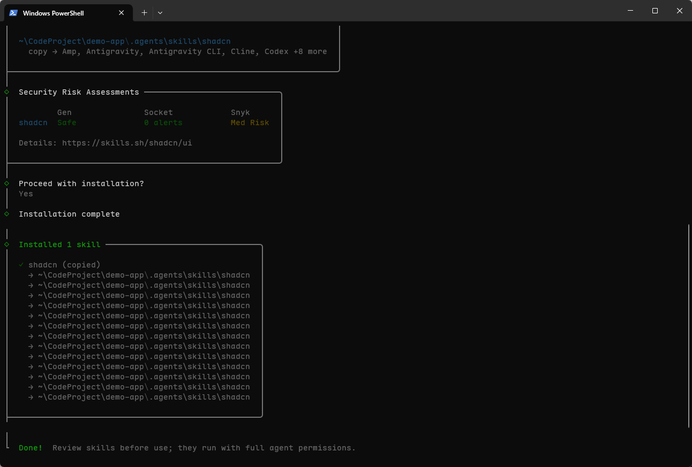

接著就能打開 ClaudeCode 開始 Vibe Coding ，後續我就不再講解具體可以查看程式碼的提交紀錄，提交完成後推送到 Github 後再開始配置 Vercel 登入後如下圖新增

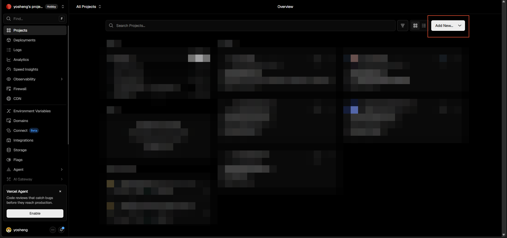

如果有關連到 GitHub 上就可以查看公開的庫，沒有就貼上地址如下圖

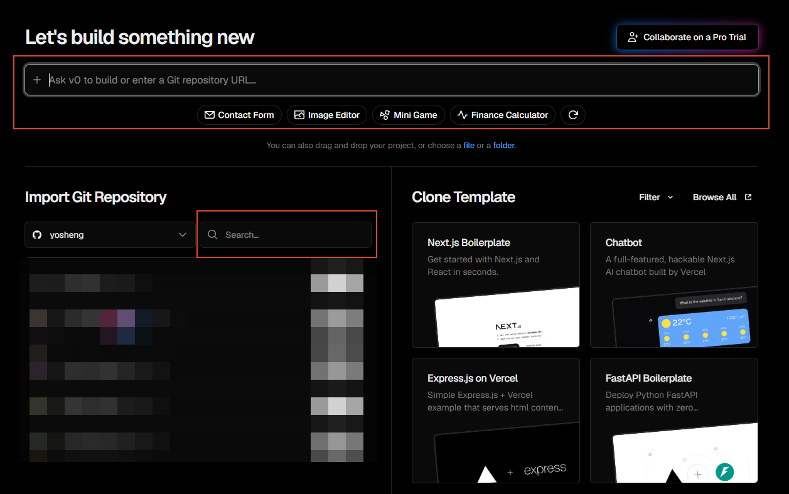

配置完成後就可以直接查看了
